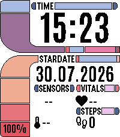
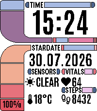

# LCARS Readout — design og status

| Slik den ser ut nå (emulator) | Med vær- og helsedata til stede |
|---|---|
|  |  |

Venstre bilde er tatt rett fra emulatoren. Emulatoren har ingen posisjons-
kilde og ingen helsedata, så vær, puls og skritt står som `--`/`0`. Høyre
bilde er samme bygg med verdiene fylt inn manuelt, for å vise hvordan det ser
ut på klokka når telefonen er tilkoblet.

## Konsept

LCARS-inspirert urskive for Pebble Time 2 (Emery, 200×228 px, farge), bygget
etter en mockup fra brukeren. Lys bakgrunn, svarte tall og pastellfargede
LCARS-former — det motsatte av klassisk LCARS, og hele poenget: tallene skal
være lette å lese i dagslys på en reflektiv skjerm.

Inspirert av LCARS-tradisjonen generelt og av layout-ideene i
`AKlitbo/pebble-watchfaces`. All kode her er egenutviklet — det prosjektet er
lisensiert PolyForm Noncommercial og ingenting derfra er kopiert.

## Layout (200×228)

Rammen — former, overskrifter og de tre faste ikonene (termometer, hjerte,
fotspor) — er **ett bakgrunnsbilde**, håndtegnet av brukeren:
`resources/images/LCARS-readout_background_3.png`. Koden tegner bare verdiene
oppå. Alle koordinater i `src/c/lcars_theme.h` er målt mot det bildet, så de
må måles om hvis illustrasjonen endres.

| Felt | Posisjon |
|---|---|
| Klokkeslett | x 52–198, y 16–72 (Antonio 58) |
| Dato | x 52–198, y 109–141 (Antonio 30) |
| Batteri | x 0–50, y 208–233 (Antonio 16) |
| Værikon | x 52, y 158, 20×20 |
| Værtilstand | x 74–126, y 159–179 |
| Temperatur | x 70–122, y 194–214 |
| Puls | x 148–198, y 159–179 |
| Skritt | x 148–198, y 194–214 |

Værikonet er det eneste ikonet som tegnes i kode, siden det er det eneste som
bytter. Det ligger på x52 og ikke i flukt med termometeret på x57, fordi
`CLEAR`/`CLOUD` trenger 47 px og x57 bare levner 43.

Bakgrunnen klargjøres av `tools/prep_background.py`, som selv plukker den
høyest nummererte `LCARS-readout_background*.png`. Alfa flates ut mot hvitt,
og hver piksel snappes til Pebble-64. Deretter skilles designfarger fra
antialiasing-frynser, slik at fargetallet holder seg under 16 og bitmapen kan
lagres som `4BitPalette` — 22 KB heap i stedet for 45 KB.

Skillet gjøres på **lengste sammenhengende stripe**, ikke på pikselantall
eller tetthet. Begge de enklere målene tar feil her: en liten solid blokk kan
være sjeldnere enn en frynse, og pills og endekapsler er solide men spredt
over hele flaten, så de ser like tynne ut som støy målt på omriss. Stripelengde
stiller spørsmålet som faktisk betyr noe — fyller fargen en solid strekning
noe sted, eller er den alltid en tynn kant?

Ekte gråtoner (`#555555`, `#AAAAAA`) håndteres for seg og løses mot svart
eller hvitt etter lyshet. Nærmeste-farge ville sendt dem et kromatisk sted:
mellomgrå ligger bare 85 fra `#005555` men 255 fra svart målt per kanal.

## Palett

Illustrasjonen er tegnet direkte på Pebble-paletten, så den overlever
konverteringen nesten intakt — bare 2,6 % av pikslene flytter seg, og det er
utelukkende antialiasing langs kanter. Sluttresultatet er 13 farger: åtte
designfarger pluss svart og hvit, og tre frynsefarger som er små nok til å
ikke telle visuelt.

| Element | Farge | Pebble-navn |
|---|---|---|
| Elbow | `#AA55AA` | Purpureus |
| Oransje blokker | `#FFAA55` | Rajah |
| Lyse barer | `#AAAAFF` | BabyBlueEyes |
| Pills og endekapsler | `#5555AA` | Liberty |
| Rød blokk | `#FF5555` | SunsetOrange |
| Rød aksent | `#FF0000` | Red |
| Rosa segment | `#FF55AA` | BrilliantRose |
| Lyse kapsler | `#FFAAFF` | RichBrilliantLavender |

Til sammenligning traff den første illustrasjonen ingen av palettfargene, og
33 % av pikslene flyttet seg — de lyse barene forsvant helt mot hvit bakgrunn.

## Typografi

**Antonio** (Google Fonts, SIL Open Font License — `resources/fonts/OFL.txt`),
i fire størrelser. Den kondenserte formen er det som gjør at `22.06.2026` i det
hele tatt får plass i en 146 px kolonne. Hver størrelse er begrenset med
`characterRegex` til akkurat de tegnene den bruker, så alle fire til sammen
veier lite.

| Ressurs | Bruk | Tegn |
|---|---|---|
| `FONT_ANTONIO_58` | klokkeslett | `[0-9:]` |
| `FONT_ANTONIO_30` | dato | `[0-9.]` |
| `FONT_ANTONIO_22` | avlesningsverdier | `[0-9A-Z%°.:-]` |
| `FONT_ANTONIO_16` | batteriprosent | `[0-9%]` |

## Ikoner

Bare de fire værikonene ligger som ressurser nå — termometer, hjerte og
fotspor er malt inn i bakgrunnen, siden de aldri endrer seg. De fire som er
igjen er 20×20 px sort-på-transparent fra **Material Symbols** (Google,
**Apache-2.0** — lisenstekst i `resources/images/LICENSE-material-symbols.txt`).

Kilde-SVG-ene ligger i `resources/images/src/`, og PNG-ene bygges av
`tools/make_icons.py`.

## Datakilder

| Felt | Kilde | Status |
|---|---|---|
| Tid, dato | `tick_timer_service` (MINUTE_UNIT) | live |
| Batteri | `battery_state_service` | live |
| Puls, skritt | `HealthService` | live på klokka, tomt i emulator |
| Vær | `src/pkjs/index.js` → Open-Meteo | krever telefon med posisjon |

Illustrasjonen har ingen plass til Bluetooth-status, så den indikatoren er
tatt ut. De to øverste blokkene i venstre skinne er dekorative — hvis en av
dem skal vise tilkobling, er det bare å si.

Værhentingen bruker Open-Meteo, som ikke krever API-nøkkel, og henter hver
30. minutt. Siste måling lagres med `persist_write_int`, så den overlever en
omstart av urskiven i stedet for å blanke ut. Felter uten data viser `--`.

**Ikke verifisert på fysisk klokke:** vær-, puls- og skrittverdiene er kun
testet i emulatoren, der de to siste er tomme og været ikke kan hentes (ingen
posisjonskilde). Selve mottakssiden i C og render-veien er verifisert ved å
fylle inn verdier manuelt — se høyre skjermbilde over.

## Bygg

```bash
cd watchfaces/lcars-readout
pebble build                      # -> build/lcars-readout.pbw
pebble install --emulator emery   # krever X-display
```

Sist bygde `.pbw` ligger i `dist/lcars-readout.pbw` og kan installeres direkte
på klokka via Pebble-telefonappen.

Bygget med `pebble-tool` 5.0.39 og Pebble SDK 4.17, target `emery`.
Ressurser 13 720 B / 256 KB, statisk RAM 2 740 B / 128 KB
(pluss ~22 KB heap for bakgrunnsbitmapen).

### Fallgruve på Linux uten IPv6

`pebble install --emulator` feiler med `[Errno 111] Connection refused` fordi
`pypkjs` binder websocket-serveren til IPv6. Fiks ved å endre
`pywsgi.WSGIServer(("", self.port), ...)` til `("0.0.0.0", self.port)` i
`pypkjs/runner/websocket.py`. Må gjentas etter hver reinstallasjon av
`pebble-tool`.
